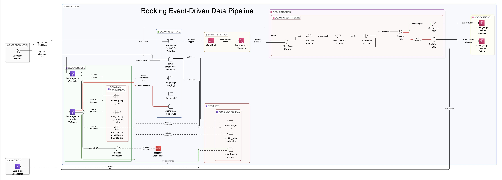
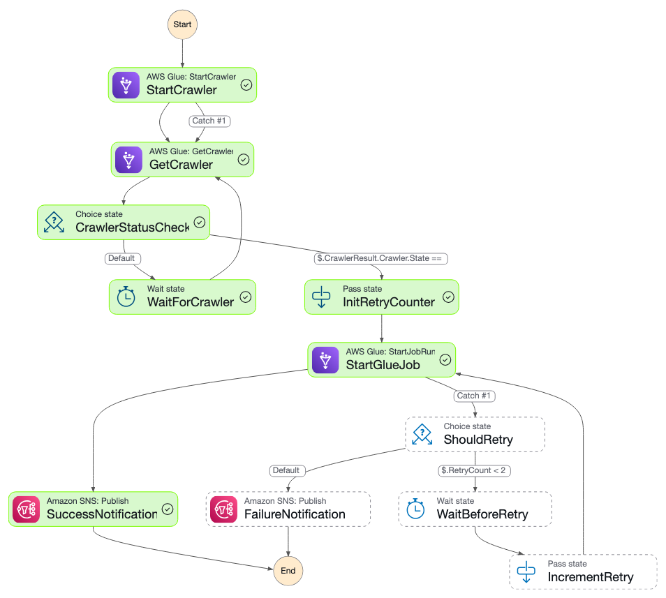

# Booking Event-Driven Data Pipeline

An event-driven batch ingestion pipeline on AWS that automatically detects when daily booking files are uploaded to **Amazon S3**, orchestrates metadata cataloging and a **PySpark ETL** job through **AWS Step Functions**, enforces **data quality validation** with a circuit-breaker mechanism, enriches raw bookings against dimension tables in a star schema, and loads curated facts into **Amazon Redshift** — with **SNS** alerts on every pipeline success or failure.

Built for high-volume, messy transactional CSV data where upstream quality is unpredictable. The pipeline validates every record, quarantines failures for investigation, and halts the load entirely when error rates breach a configurable threshold — ensuring the warehouse stays trustworthy for downstream analytics and dashboards.

---

## Architecture

`S3 (PutObject) → CloudTrail → EventBridge → Step Functions → Glue Crawler → Glue ETL Job → Redshift + SNS`

### Step Functions — orchestration detail

---

## Pipeline metrics

| Metric | Demo scale | Production considerations |
|--------|-----------|--------------------------|
| **Daily file volume** | ~120 MB CSV, ~1M rows per file | Scales horizontally — Glue auto-provisions workers; increase `--NumberOfWorkers` for larger files or partition into multiple files per day |
| **Data quality (bad row %)** | ~3.5% intentionally messy (nulls, orphan FKs, bad dates, invalid status) | Threshold is **configurable** — current circuit breaker at **5%**; production teams tune per SLA |
| **Circuit breaker** | Job **fails** if bad share > **5%** of the batch | Prevents silently loading corrupted data; integrate with PagerDuty/Slack via SNS for immediate response |
| **Good records per run** | ~950k–970k rows land in Redshift after DQ + dimension joins | Append-only in demo; production would add **merge/upsert** with `booking_id` deduplication |
| **Glue job config** | Glue **4.0**, Spark **3.3**, Python 3, **G.1X** (2 workers) | Right-size workers based on CloudWatch metrics; enable **auto-scaling** for variable file sizes |
| **Retry strategy** | Up to **2 retries** with wait between attempts via Step Functions | Add exponential backoff and dead-letter queues for persistent failures |
| **Notification** | Dual SNS topics — **success** + **failure** | Extend to CloudWatch dashboards, composite alarms, or Chatbot for Slack/Teams integration |
| **Redshift target** | `bookings.daily_bookings_fact` + 2 dimension tables | Partition fact table by date, add sort keys on query patterns, enable Redshift Spectrum for historical cold data |

---

## Tech stack

| Layer | Services |
|-------|----------|
| Object storage | **Amazon S3** — raw partitions (`raw/bookings/date=YYYYMMDD/`), dimension CSVs (`dims/`), quarantine, Glue temp + script paths |
| Audit / event capture | **AWS CloudTrail** — S3 data events (write-only) on the pipeline bucket |
| Event routing | **Amazon EventBridge** — rule matching `PutObject` / `CompleteMultipartUpload` under `raw/bookings/` |
| Orchestration | **AWS Step Functions** — sequences crawler → ETL job → SNS; handles retries and failure branching |
| Metadata catalog | **AWS Glue Data Catalog** — two crawlers (S3 raw + JDBC for Redshift dims) feeding one catalog database |
| Transform | **AWS Glue ETL** — PySpark job: type casting, value standardization, DQ validation, quarantine split, circuit breaker, dimension joins, schema mapping |
| Warehouse | **Amazon Redshift** — star schema (`properties_dim`, `booking_channels_dim`, `daily_bookings_fact`) |
| Alerts | **Amazon SNS** — separate topics for pipeline success and failure notifications |
| Security | **IAM** roles (least-privilege per service), **VPC** security groups, optional **Secrets Manager** for Redshift credentials |
| Analytics | **Amazon QuickSight** (optional) — dashboards on the curated fact table |

---

## End-to-end workflow

1. **Land** — Upstream batch process uploads a daily booking CSV to `s3://booking-edp-data/raw/bookings/date=YYYYMMDD/`.
2. **Detect** — CloudTrail captures the S3 write event; EventBridge matches the bucket and key prefix pattern, triggering the Step Functions state machine.
3. **Catalog** — Step Functions starts the Glue S3 crawler (`booking-edp-s3-crawler`) and polls until the crawler status is **READY**, ensuring the Data Catalog reflects the latest partition.
4. **Transform** — The Glue ETL job (`booking-edp-etl-job`) reads raw bookings and Redshift dimensions from the catalog, casts types, standardizes values, splits good vs bad records, writes bad records to `s3://…/quarantine/`, enforces the **5% circuit breaker**, joins good records with `properties_dim` and `booking_channels_dim`, applies analyst-friendly column names, and loads enriched facts into `bookings.daily_bookings_fact`.
5. **Notify** — On success → SNS success topic; on failure after retries → SNS failure topic with error context.
6. **Analyze** — Analysts query Redshift directly or use QuickSight dashboards backed by the curated fact table.

---

## Key engineering features

- **Data quality validation** — Null checks, referential integrity (orphan property/channel IDs), range validation (negative amounts, checkout before checkin), status allowlist enforcement
- **Quarantine path** — Bad records written to S3 as CSV for root-cause investigation without polluting the warehouse
- **Circuit breaker** — Configurable threshold (5%); pipeline halts and alerts operators when data quality degrades beyond acceptable limits
- **Column standardization** — Raw OLTP column names mapped to analyst-friendly names via `ApplyMapping` (e.g. `status` → `booking_status`, `rooms` → `num_rooms`)
- **Value standardization** — Inconsistent casing and formatting normalized (e.g. `credit_card` → `Credit Card`, `no show` → `NO_SHOW`)
- **Type casting** — String values cast to proper types: `DECIMAL(10,2)`, `DATE`, `TIMESTAMP`, `BIGINT`, `INT`
- **Dual dimension joins** — Properties (hotel metadata) and booking channels enriched onto every fact row
- **Orchestration with error handling** — Step Functions manages crawler polling, Glue job sync execution, bounded retries, and branched SNS notifications

---

## Analytics dashboard

**Amazon QuickSight** connects to `bookings.daily_bookings_fact` for executive-style KPIs — booking volume, confirmed revenue, cancellation rate by channel, city and chain concentration, stay-length distribution, lead-time analysis, and payment method mix.

[View Dashboard PDF](./Booking_Performance__Dashboard.pdf)

---

## Repository layout

| Path | Description |
|------|-------------|
| `glue_job.py` | Glue PySpark ETL — catalog reads, DQ validation, quarantine, circuit breaker, dimension joins, Redshift load. |
| `bookings_redshift_schema.sql` | Redshift DDL + COPY for dimension tables; fact table definition. |
| `bookings_redshift_analytics.sql` | Analytical SQL queries — KPIs, trends, channel analysis, lifecycle checks. |
| `Architecture_diagram.jpeg` | End-to-end architecture diagram. |
| `stepfunctions_graph.png` | Step Functions state machine — design-mode screenshot. |
| `Booking_Performance__Dashboard.pdf` | QuickSight dashboard export. |
| `Dataset/dims/` | Dimension CSVs (`properties_dim.csv`, `booking_channels_dim.csv`). |
| `Dataset/sample_daily_bookings/` | Daily booking files partitioned by date (`date=YYYYMMDD/`). |

---

## Author

**Osama Mustafa**

- LinkedIn: [your-linkedin-url]
- GitHub: [your-github-url]
